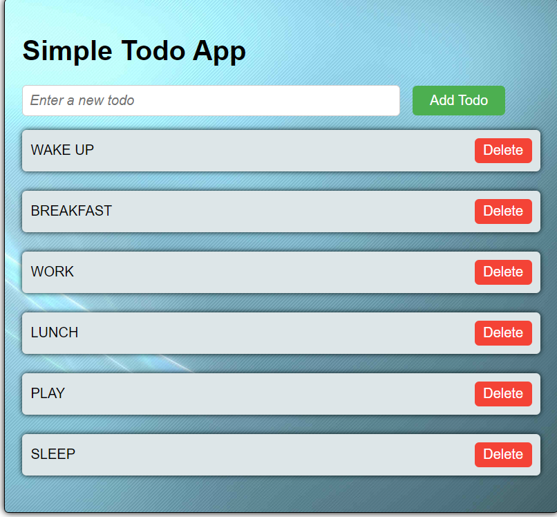

# 📝 Simple To-Do List App

A basic and responsive To-Do List web application built using **HTML**, **CSS**, and **JavaScript**. This project is great for beginners learning DOM manipulation and event handling.

## 🚀 Features

- ✅ Add new tasks  
- 🗑️ Delete tasks  
- ✔️ Mark tasks as completed  
- 🧼 Clear all tasks (optional if implemented)

## 🖥️ Demo

> [Add a link here if you have it hosted (e.g., GitHub Pages)]  
> Example: https://yourusername.github.io/simple-todo-list/

## 📸 Screenshot

> *(Include a screenshot of your app if you have one)*  
> 

## 🛠️ Built With

- HTML  
- CSS  
- JavaScript

